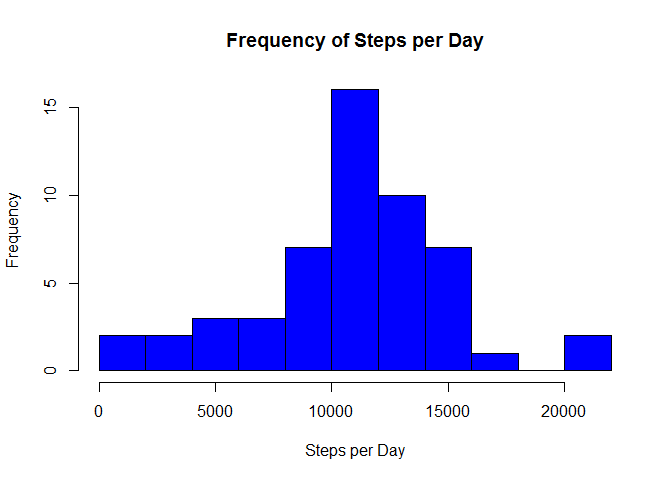
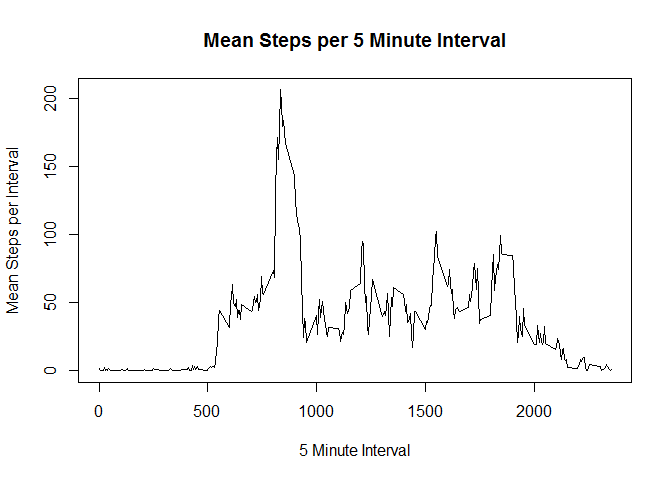
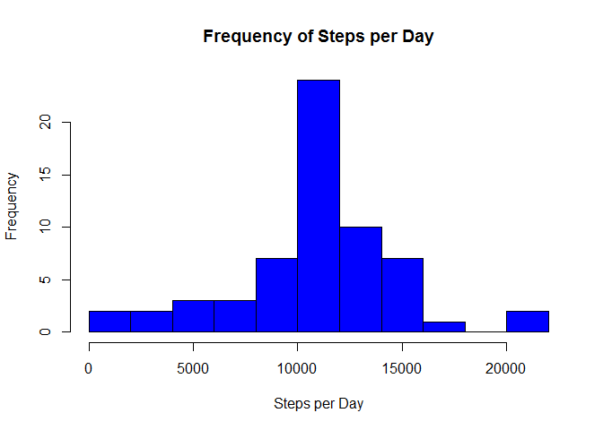

Executive Summary
-----------------

The purpose of this analysis is to analyze the number of steps taken
during 5 minute intervals, using an exercise device to track movement.
We first plot the average number of steps (by interval) over a series of
users. We then determine the mean and median steps by interval. Finally,
we impute values for each 'missing' step value in the data set and,
based on this updated data set, graphically display the difference in
steps taken on the weekdays versus the weekends.

Step 1 in Analysis
------------------

First, we read in the data set, remove all NA values, and draw a
histogram of the frequency of steps taken (during each 5 minute
interval). We then display the mean and median number of steps over all
values.

Finally, we graph the mean number of steps taken during each 5 minute
interval (across all users) and determine the 5 minute interval
associated with the maximum average number of steps.

    library(lubridate)

    ## Warning: package 'lubridate' was built under R version 3.3.3

    ## 
    ## Attaching package: 'lubridate'

    ## The following object is masked from 'package:base':
    ## 
    ##     date

    library(dplyr)

    ## Warning: package 'dplyr' was built under R version 3.3.3

    ## 
    ## Attaching package: 'dplyr'

    ## The following objects are masked from 'package:lubridate':
    ## 
    ##     intersect, setdiff, union

    ## The following objects are masked from 'package:stats':
    ## 
    ##     filter, lag

    ## The following objects are masked from 'package:base':
    ## 
    ##     intersect, setdiff, setequal, union

    setwd("C:/Users/djflick/My Documents/R Programming Assignments/Rep_Research")

    data<-read.csv("activity.csv",header=T,stringsAsFactors=F)

    data$datej<-julian(as.Date(data$date))

    data.nona<-data[!is.na(data$steps),]

    steps.day<-group_by(data.nona,datej)
    data.sumbyday<-summarize(steps.day,total.steps=sum(steps))

    hist(data.sumbyday$total.steps, breaks=10, col="blue", xlab="Steps per Day", main="Frequency of Steps per Day")

    #Calculate the mean and median number of steps per day
    mean.steps<-mean(data.sumbyday$total.steps)
    median.steps<-median(data.sumbyday$total.steps)

    # Print the mean and median steps per day
    print(paste("Mean steps per day is ", mean.steps))

    ## [1] "Mean steps per day is  10766.1886792453"

    print(paste("Median steps per day is ",median.steps))

    ## [1] "Median steps per day is  10765"

    #Calculate the number of steps in each interval - and the avg steps per interval - then plot
    steps.interval<-group_by(data.nona,interval)
    avginterval<-summarize(steps.interval,meansteps.interval=mean(steps))

    plot(avginterval$interval,avginterval$meansteps.interval,type='l',xlab="5 Minute Interval", 
         ylab="Mean Steps per Interval",main="Mean Steps per 5 Minute Interval")

    #Find the interval with the highest mean number of steps across all days
    index.high<-which(avginterval$meansteps.interval==max(avginterval$meansteps.interval))
    print(paste("5 Minute Interval associated with max number of steps per day is Interval",avginterval[index.high,1]))

    ## [1] "5 Minute Interval associated with max number of steps per day is Interval 835"

Step 2 in Analysis
------------------

In step 2, we first determine the number of observations in the original
data set that contain incomplete data. For each missing value (of the
STEPS variable), we impute a step value equal to the average number of
steps associated with the associated interval (across all non-missing
values). We then draw a histogram of the frequency of steps, using this
updated data set. We note that there is no difference in the mean number
of steps using this updated data set (compared to the original). The
MEDIAN of this updated data set is only slightly different than the
original data set's MEDIAN number of steps.

    print(paste("The number of rows that do not contain complete data is ",sum(!complete.cases(data))))

    ## [1] "The number of rows that do not contain complete data is  2304"

    data.new<-data

    for (i in 1:nrow(data))      
     {      ifelse (is.na(data[i,1]), 
            data.new[i,1]<-avginterval[as.integer(which(avginterval$interval==data[i,3])),2],
            data.new[i,1]<-data[i,1])
     }  

    #Calculate the number of steps by day, using the data set with imputed values 
    steps.day<-group_by(data.new,datej)
    data.sumbyday<-summarize(steps.day,total.steps=sum(steps))

    #Draw histogram of total steps taken per day

    hist(data.sumbyday$total.steps, breaks=10, col="blue", xlab="Steps per Day", main="Frequency of Steps per Day")

    #Calculate the mean and median number of steps per day
    mean.steps<-mean(data.sumbyday$total.steps)
    median.steps<-median(data.sumbyday$total.steps)

    # Print the mean and median steps per day
    print(paste("Mean steps per day is ", mean.steps))

    ## [1] "Mean steps per day is  10766.1886792453"

    print(paste("Median steps per day is ",median.steps))

    ## [1] "Median steps per day is  10766.1886792453"

Step 3 in Analysis
------------------

Finally, we compare the average number of steps taken across each
interval during the weekends and weekdays. The final chart shows the
averages for the two, plotted against each other.

    data.new$wkday<-weekdays(as.Date(data.new$date))

    data.new$wkday<-ifelse (data.new$wkday=="Saturday" | data.new$wkday=="Sunday","Weekend", "Weekday")

    data.new$wkday<-as.factor(data.new$wkday)

    datanew.day<-data.new[data.new$wkday=="Weekday",]
    datanew.end<-data.new[data.new$wkday=="Weekend",]

    steps.dayinterval<-group_by(datanew.day,interval)
    steps.endinterval<-group_by(datanew.end,interval)

    avgintervalday<-summarize(steps.dayinterval,meansteps.dayinterval=mean(steps))
    avgintervalend<-summarize(steps.endinterval,meansteps.endinterval=mean(steps))

    plot(avgintervalday$interval,avgintervalday$meansteps.dayinterval,type='l',xlab="5 Minute Interval", 
         ylab="Mean Steps per Interval",main="Mean Steps per 5 Minute Interval",col="red")

    lines(avgintervalend$interval,avgintervalend$meansteps.endinterval,type='l',col="blue")
    legend("topright",c("Weekday","Weekend"),lwd=c(2.5,2.5),col=c("red","blue"))

